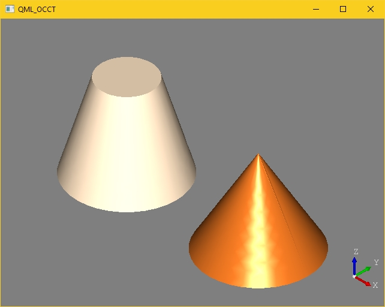

# Using OpenCascade in QtQuick 2

This project is a fork of the example project of [Anton Shabalin](https://github.com/ShabalinAnton), which was based on [Guiseppe D'Angelos](https://github.com/KDAB/integrating-qq2-with-opengl) QQ2/OpenGL example and the official OCCT AndriodQt sample code.

# Improvements

The fork improves the example regarding the following points:

- Largely simplified codebase compared to the original version.
- Switched implementation to use `QQmlApplicationEngine` and `ApplicationWindow`.
- Support for recent versions of OpenCascade (7.3.0) and Qt (5.12).
- Removed dependency on private headers (allows for dynamic linking).
- Build tested in Visual Studio 2019 (vc150), 2017 (vc141) and Qt Creator (4.9.2). 

Note that platforms other than Windows may require slight modifications, mainly replacing native calls to `wglGetCurrentDC` and `wglGetCurrentContext` and respective include of `<windows.h>` with appropriate APIs.

## Removed from original example

I've removed all mouse interactivity, to keep the example simple. It should be pretty straightforward to wire up the mouse events to OCCT transforms. The AndroidQt sample provides a good starting point. 

## License 

[GNU Lesser General Public License 3.0](./LICENSE)